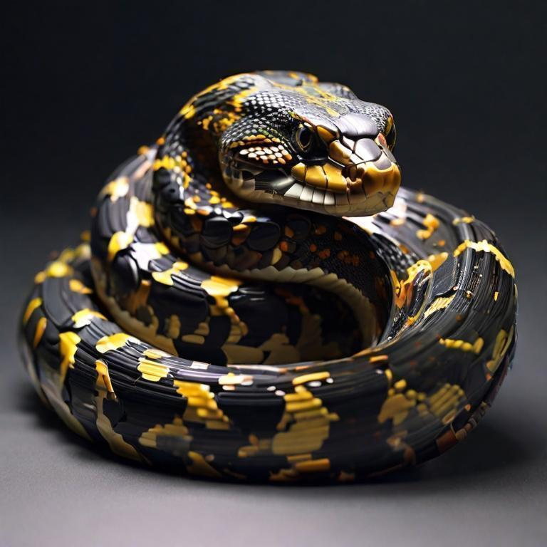

## Python-for-Data-Science
Python for Data Science

> [!NOTE]
> Here I am going to share what I have learned from the Python Piscine

## `Python-0-Starting`
-   The basic data structures and how to manipulate them
-   How to work with and manipulate the time
-   How to format time and strings, what are scientific values
-   Identification of object type and type-based output
-   Function Implementation
-   The NULL Types
-   How to use argv in python

> [!TIP]
> Useful resources

- https://www.w3schools.com/python/default.asp
- https://docs.python.org/3/
- https://www.geeksforgeeks.org/python-programming-language/
- https://www.tutorialspoint.com/python/index.htm
- https://realpython.com/

> [!IMPORTANT]
> There are more exercise depending resources in every .py file
